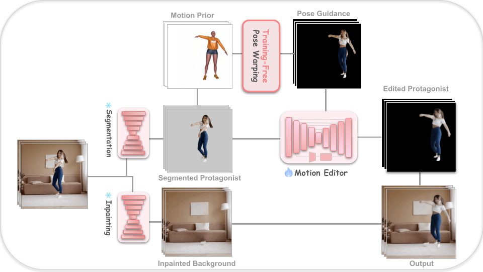

# MysticMorphor
## 🩰  Simultaneous Motion-Location Editing for In-the-Wild Videos

<p align="left"> <i> Prompt: "The boy flies in the greenary forest" </i> </p>
<table align="left">
<tr>
<td align="left">
<br>
<p align="center"><b>Source</b></p>
</td>

<td align="left">
<br>
<p align="center"><b>Edited</b></p>
</td>
</tr>
</table>

<br><br><br><br><br><br><br><br><br><br><br><br><br><br><br>

---

## Challenge Analysis: What Makes the Editing Difficult?

👓 **Large motion gaps:** differences between source and target motions <br>
👓 **Location shifts:** change of the protagonist’s spatial position <br>
👓 **Complex backgrounds:** dynamic and complicated backgrounds <br>
👓 **Camera movement:** change of camera position <br>
👓 **Character-background similarity:** similar appearance between the character and the background  <br>
👓 **Temporal inconsistency:** large gap between frames <br>

---

## Our Solution: MysticMorphor
<p align="left">
  
</p>

**Source of the Videos Used in This Study:** <br>
YouTube & AI video generator ([Hailuo AI](https://artlist.io/ai/models/hailuo-ai?utm_source=google&utm_medium=cpc&utm_campaign=23088929427&utm_content=197649277633&utm_term=&keyword=&ad=807679767737&matchtype=a&device=c&gad_source=1&gad_campaignid=23088929427&gbraid=0AAAAACuwFJ2-djoohOGlAI6BAN4kGfyk8&gclid=Cj0KCQjwz9_QBhD_ARIsADnSCfBrQd1NVLxargFICjwoVgLkMGgmk4eUBQLKN3B0cGOlALLxpRkYLXIaAs5dEALw_wcB), [Pexel](https://www.pexels.com/))

**How Simultaneous Motion-Location Editing Is Possible?** <br>
🪢 Foreground-background disentangled editing <br>
🤾‍♀️ Guided by motion priors <br>
💄 Training-free protagonist guidance

---

## Implementation (Quik Start)

1. Follow [MotionEditor](https://github.com/Francis-Rings/MotionEditor) installation.
2. Prepare inputs in the `sample_input` folder.
3. Segment the protagonist from the background using a pre-trained segmentation model (e.g., SAM).
4. Inpaint the background using any off-the-shelf inpainting model.
5. Execute "Training-Free Pose Warping" for the protagonist's pose and location using the scripts in the `data_preparation` folder.
6. Train with `MysticMorphor(Extended_MotionEditor)/train/train_bg.py`.
7. Train with `MysticMorphor(Extended_MotionEditor)/train/train_adaptor.py`.
8. Get the edited protagonist result with `MysticMorphor(Extended_MotionEditor)/inference.py`.
9. Merge the edited protagonist onto the previously inpainted background.

---

## Result Analysis

### 🔍 What Progress Have We Made?

| Method | Motion Editing | Location Editing | Training Requirement | Limitation |
|:------:|:------:|:--------:|:-------------------:|:---------------:|
| Follow-Your-Pose | ✅ | ❌ | Training Required | Appearance drift |
| ControlVideo | ⚠️ | ❌ | Training-Free | Weak motion alignment |
| MasaCtrl | ⚠️ | ❌ | Training-Free | Poor motion controllability |
| MotionDirector | ✅ | ❌ | 1 Sample | Appearance inconsistency |
| MotionEditor | ✅ | ❌ | 1 Sample | Motion conflict & flickering |
| **MysticMorphor (Proposed)** | ✅ | ✅ | 1 Sample | Color shift of protagonist |

### 🔍 Quantitative Comparison

| Method                   |     L-S ↓ |     L-N ↓ |     L-T ↓ |      L-B ↓ |     L-P ↓ |    CLIP ↑ |
| :----------------------- | --------: | --------: | --------: | ---------: | --------: | --------: |
| Source Video             |    ≤0.001 |     0.082 |     0.708 |     ≤0.001 |     0.264 |     28.63 |
| Target Motion Prior      |     0.709 |     0.053 |    ≤0.001 |      0.659 |    ≤0.001 |     24.52 |
| Follow-Your-Pose         |     0.562 |     0.163 |     0.709 |      0.501 |     0.153 |     28.00 |
| ControlVideo             |     0.330 |     0.070 |     0.768 |      0.362 |     0.266 |     29.52 |
| MasaCtrl                 |     0.514 |     0.097 |     0.566 |      0.428 |     0.123 |     27.94 |
| MotionDirector           |     0.605 |     0.076 |     0.695 |      0.581 |     0.285 |     29.47 |
| MotionEditor             |     0.310 |     0.146 |     0.668 |      0.252 |     0.094 |     29.29 |
| **MysticMorphor (Ours)** | **0.289** | **0.099** | **0.655** | **≤0.001** | **0.074** | **30.01** |

### 🔍 Qualitative Comparison (Human Evaluation)

| Method | M-A ↑ | A-A ↑ | T-A ↑ |
|:---|---:|---:|---:|
| Follow-Your-Pose | 97.1% | 94.6% | 91.5% |
| ControlVideo | 84.2% | 69.4% | 83.3% |
| MasaCtrl | 92.5% | 94.5% | 91.2% |
| MotionDirector | 93.7% | 93.3% | 85.2% |
| MotionEditor | 75.3% | 81.2% | 79.9% |

LPIPS-s, LPIPS-N, LPIPS-T, and CLIP, and newly defined LPIPS-B, LPIPS-P are used for quantitative evaluation (left table). This work also conducted a user study (right table). The questions of the study were as follows: (1) Which video exhibits better alignment with the target motion? (M-A) (2) Which video better preserves the appearance of the source video? (AA) (3) Which video better aligns with the given text prompt? (T-A). A higher percentage represents the superiority of the results from our proposed method.

**<i>Results Archive:<i>** [Google Drive](https://drive.google.com/drive/folders/1rt38TtxN_BhU_oEaX3AOGvqoRQgo7jfc?usp=drive_link)

---

## Acknowledgement
Our project is heavily based on [MotionEditor](https://github.com/Francis-Rings/MotionEditor) (CVPR 2024). <br>
We thank the authors for publicly releasing their code.<br>
This project followed the software environment of MotionEditor. <br>

```bibtex
@inproceedings{tu2024motioneditor,
  title={Motioneditor: Editing video motion via content-aware diffusion},
  author={Tu, Shuyuan and Dai, Qi and Cheng, Zhi-Qi and Hu, Han and Han, Xintong and Wu, Zuxuan and Jiang, Yu-Gang},
  booktitle={CVPR},
  year={2024}
}
```

## Contact
If you have questions about this study, please contact via the mail (hb0522@snu.ac.kr)

