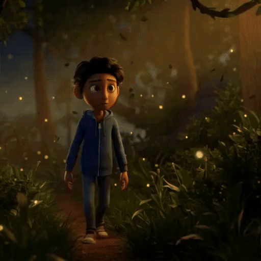
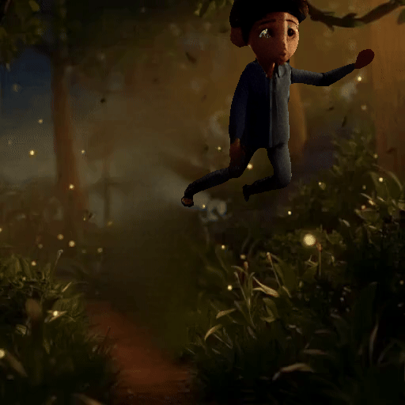
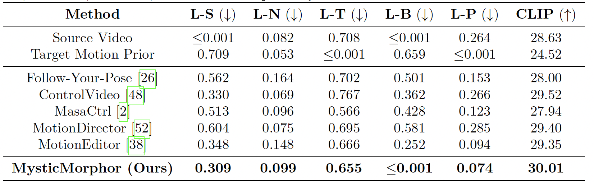
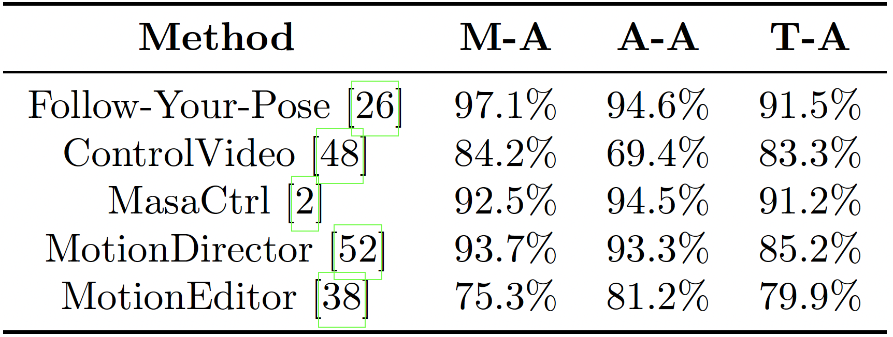

## 🕹️ Motion&Location Editing of a Character of the Videos In-The-Wild

<table align="left">
<tr>
<td align="left">
<b>Source</b><br>

</td>

<td align="left">
<b>Edited</b><br>

</td>
</tr>
</table>

<br><br><br><br><br><br><br><br><br><br><br><br><br><br><br>

<p align="center"> <i> Prompt:The boy flies in the greenary forest</i> </p>

<br>

---

## Bottom-Up Problem Analysis: What Makes the Editing Difficult?

👓 Large motion gaps: differences between source and target motions <br>
👓 Location shifts: change of the protagonist’s spatial position <br>
👓 Complex backgrounds: dynamic and complicated backgrounds <br>
👓 Camera movement: change of camera position <br>
👓 Character-background similarity: similar appearance between the character and the background  <br>
👓 Temporal inconsistency: large gap between frames <br>

## Our Solution: MysticMorphor
<p align="left">
  
</p>

**Source Video:** <br>
YouTube & AI video generator ([Hailuo AI](https://artlist.io/ai/models/hailuo-ai?utm_source=google&utm_medium=cpc&utm_campaign=23088929427&utm_content=197649277633&utm_term=&keyword=&ad=807679767737&matchtype=a&device=c&gad_source=1&gad_campaignid=23088929427&gbraid=0AAAAACuwFJ2-djoohOGlAI6BAN4kGfyk8&gclid=Cj0KCQjwz9_QBhD_ARIsADnSCfBrQd1NVLxargFICjwoVgLkMGgmk4eUBQLKN3B0cGOlALLxpRkYLXIaAs5dEALw_wcB), [Pexel](https://www.pexels.com/))

**Key Functions:** <br>
🪢 Foreground-background disentangled editing <br>
🤾‍♀️ Guided by motion priors <br>
💄 Training-free protagonist guidance

---

## Performance

<p align="left">
   
</p>
LPIPS-s, LPIPS-N, LPIPS-T, and CLIP, and newly defined LPIPS-B, LPIPS-P are used for quantitative evaluation (left table). This work also conducted a user study (right table). The questions of the study were as follows: (I) Which video exhibits better alignment with the target motion? (M-A) (II) Which video better preserves the appearance of the source video? (AA) (III) Which video better aligns with the given text prompt? (T-A). A higher percentage represents the superiority of the results from our proposed method.

---

## Acknowledgement
Our project is heavily based on [MotionEditor](https://github.com/Francis-Rings/MotionEditor) (CVPR 2024)

```bibtex
@inproceedings{tu2024motioneditor,
  title={Motioneditor: Editing video motion via content-aware diffusion},
  author={Tu, Shuyuan and Dai, Qi and Cheng, Zhi-Qi and Hu, Han and Han, Xintong and Wu, Zuxuan and Jiang, Yu-Gang},
  booktitle={CVPR},
  year={2024}
}
```
---

## Installation

```bash
git clone https://github.com/yourname/MysticMorphor.git
cd MysticMorphor

conda create -n mystic python=3.10
conda activate mystic

pip install -r requirements.txt
